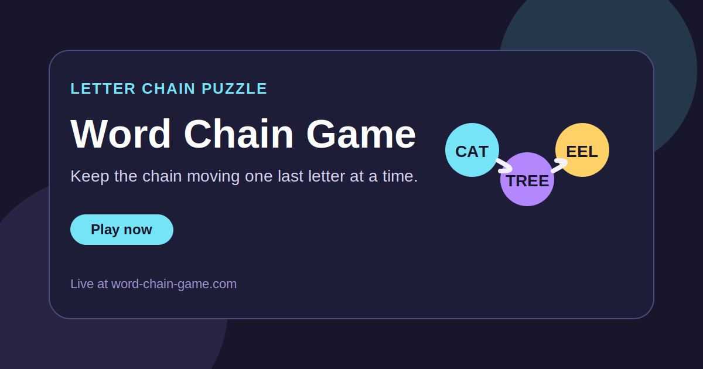

<h1 align="center">Word Chain Game</h1>

  A lightweight word puzzle where every next answer begins with the last letter of the previous one.

  <a href="https://word-chain-game.com/"><strong>Play Now</strong></a>
  ·
  <a href="https://github.com/ivanlukichev/Word-Chain-Game"><strong>GitHub Repo</strong></a>
  ·
  <a href="https://github.com/ivanlukichev"><strong>More Projects</strong></a>

  

## What It Is

Word Chain Game is a fast browser word puzzle built around one clear rule: keep the chain alive by starting each new word with the final letter of the previous one. The idea is familiar, but the delivery is streamlined for short web sessions and instant replayability.

This public repo is meant to be a clean front door for the product rather than a technical dump. It shows what the game is, where to play it, and how it fits into a broader family of small web projects.

## Why It Feels Different

- One mechanic is enough when the pacing feels good.
- The game works as both a puzzle and a vocabulary challenge.
- Browser-first delivery removes all setup friction.
- The GitHub page is shaped as a public product card for sharing.

## Project Snapshot

- Genre: word puzzle
- Language: English
- Stack: static front end
- Core loop: continue the letter chain without repeating words
- UX goal: instant play and short repeatable sessions

## More Projects

| Project | Live site | Public repo |
| --- | --- | --- |
| Goroda | [goroda-na.ru](https://goroda-na.ru/) | [Goroda-na](https://github.com/ivanlukichev/Goroda-na) |
| Slova Game | [slova-game.ru](https://slova-game.ru/) | [SlovaGame](https://github.com/ivanlukichev/SlovaGame) |
| BlockPlay | [blockplaygame.com](https://blockplaygame.com/) | [BlockPlay-Game](https://github.com/ivanlukichev/BlockPlay-Game) |
| PlayMathPuzzles | [playmathpuzzles.com](https://playmathpuzzles.com/) | [PlayMathPuzzles](https://github.com/ivanlukichev/PlayMathPuzzles) |
| Number Hunt | [numberhuntgame.com](https://numberhuntgame.com/) | [numberhuntgame](https://github.com/ivanlukichev/numberhuntgame) |
| Sudoku Play | [sudoku-play.org](https://sudoku-play.org/) | [Sudoku-Play](https://github.com/ivanlukichev/Sudoku-Play) |
| PickWinner | [pickwinner.tools](https://pickwinner.tools/) | [pickwinner](https://github.com/ivanlukichev/pickwinner) |
| HTTPTools | [httptools.net](https://httptools.net/) | [HTTPTools](https://github.com/ivanlukichev/HTTPTools) |

## Visit

  <a href="https://word-chain-game.com/"><strong>Open Word Chain Game</strong></a> 
  A simple language puzzle for quick browser sessions and replayable word chains.

